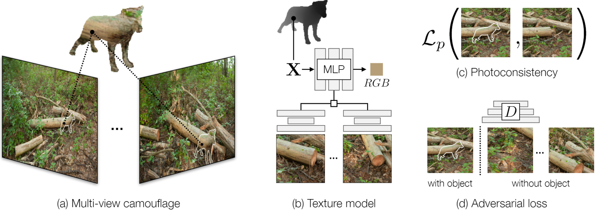

# GANmouflage: 3D Object Nondetection with Texture Fields

> 本项目 fork 自 [rrrrrguo/ganmouflage](https://github.com/rrrrrguo/ganmouflage)，并在此基础上适配、修复和细化环境配置，保留原作者信息。

Rui Guo<sup>1</sup>, Jasmine Collins<sup>2</sup>, Oscar de Lima<sup>1</sup>, Andrew Owens<sup>1</sup>  
<sup>1</sup>University of Michigan <sup>2</sup>UC Berkeley



本仓库为论文 [GANmouflage: 3D Object Nondetection with Texture Fields (arXiv:2201.07202v2)](https://arxiv.org/abs/2201.07202) 的官方代码实现。  
本地已附带论文 PDF：`2201.07202v2.pdf`

---

## 环境配置（推荐）

本项目已适配并锁定如下核心依赖（**不可更改**）：
- Python 3.8
- PyTorch 1.13.0 + CUDA 11.7
- torchvision 0.14.0
- torchaudio 0.13.0
- kornia 0.7.3
- pytorch3d 0.7.3

**一键复现环境：**
```bash
# 推荐使用 conda
conda env create -f environment_camoGAN_py38pt113cu117.yml
conda activate camoGAN_py38pt113cu117
# 或完全锁定版本
conda create --name camoGAN_py38pt113cu117 --file environment_camoGAN_py38pt113cu117.txt
```
如需自定义环境，请参考 `environment_camoGAN_py38pt113cu117.yml`。

---

## 数据集准备

- **场景图片数据**  
  下载：[Owens et al., 2014 camo-data.zip](https://andrewowens.com/camo/camo-data.zip)  
  解压到项目外部目录，确保路径为 `../camo-data/`。  
  然后运行：
  ```bash
  python get_num_views.py
  ```

- **动物形状数据**  
  下载：[Google Drive](https://drive.google.com/file/d/1gZJgqx4Lwp--oHAJQ3ZCwpWZHQEjncvO/view?usp=sharing)  
  来源：[SMAL](https://smal.is.tue.mpg.de/)，解压到 `../fake_animals_v4/`。

- **一键准备脚本**  
  ```bash
  sh ./prepare_data.sh
  ```

---

## 训练与生成

- **训练**  
  推荐直接运行：
  ```bash
  bash train_ddp.sh
  ```
  可通过 `--scene SCENE_NAME` 指定场景，通过 `--animals` 切换动物形状。

- **生成纹理**  
  ```bash
  bash generate.sh
  ```

---

## 重要说明

- `.gitignore` 已自动忽略大数据目录和中间结果：`camo-data/`、`fake_animals_v4/`、`test_code/`、`test_result/`
- 推荐使用多卡训练，分布式配置见 `train_ddp.sh`
- 详细依赖与复现环境见 `environment_camoGAN_py38pt113cu117.yml` 和 `environment_camoGAN_py38pt113cu117.txt`

---

## 论文引用

如本项目对你有帮助，请引用原论文：

```
@article{guo2022ganmouflage,
  title={GANmouflage: 3D Object Nondetection with Texture Fields},
  author={Guo, Rui and Collins, Jasmine and de Lima, Oscar and Owens, Andrew},
  journal={arXiv preprint arXiv:2201.07202},
  year={2022}
}
```
[arXiv:2201.07202v2](https://arxiv.org/abs/2201.07202)

---

## 致谢

- 代码参考自 [Owens et al., 2014](https://andrewowens.com/camo/)
- 动物形状数据来源 [SMAL](https://smal.is.tue.mpg.de/)

---

如有问题欢迎提 issue 或联系作者。
